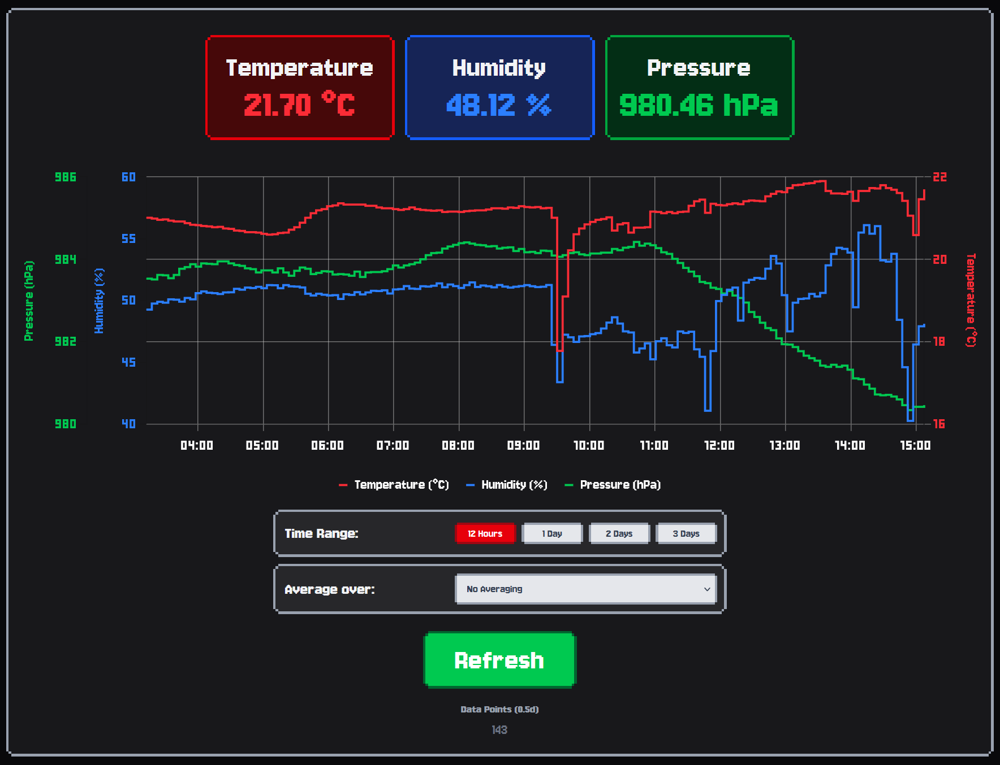

include image:
    

# Temperature Dashboard

Small single-page web app that displays the temperature, humidity, and pressure readings of a local sensor, automated through ThingSpeak over a Raspberry Pi.

Built with React, Python, and ChartJS
